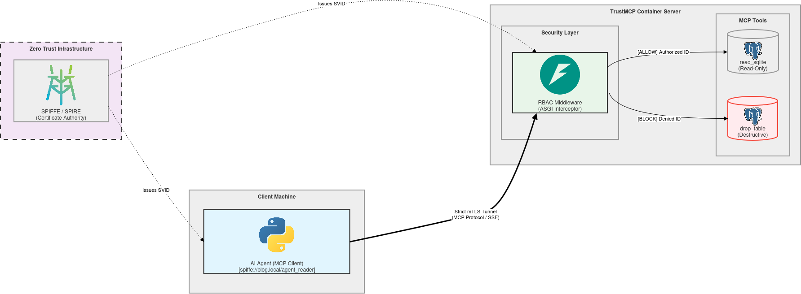

# TrustMCP - Zero Trust Model Context Protocol

TrustMCP is a secure implementation of the **MCP (Model Context Protocol)** based on a **Zero Trust** architecture.

This project solves one of the critical flaws in current MCP servers: the lack of granular identity management. By protecting the MCP server with **SPIFFE/SPIRE** and strict **mTLS**, TrustMCP prevents privilege escalation in the event of a *Prompt Injection* attack on an autonomous AI Agent.



## Features (V1 Complete)

- **Cryptographic Identities:** Uses SPIFFE/SPIRE to issue unique and ephemeral certificates (SVIDs) to containers.

- **Strict mTLS:** The MCP server rejects any connection that does not present a valid client certificate signed by the SPIRE authority.

- **Dynamic RBAC Middleware:** A pure ASGI proxy intercepts JSON-RPC requests. It verifies the client's identity (SPIFFE ID) and firmly blocks unauthorized tools using a "Jedi Mind Trick" payload rewriting technique to prevent server crashes.

- **Hot-Reloading Security Policies:** Access rights are managed via an external `rbac_policy.yaml` file that updates in real-time without requiring a server restart.

- **Autonomous AI Agent:** Integrated with **OpenAI (GPT-4o-mini)**, the client acts as an autonomous security guard capable of reasoning, executing authorized SQL queries on a real SQLite database, handling security rejections gracefully, and generating comprehensive reports.

## Project Architecture

```text
TrustMCP/
├── infrastructure/               # SPIRE configuration files
│   ├── init-spire.sh             # Workload registration script
│   ├── server.conf               # SPIRE Server configuration
│   └── agent.conf                # SPIRE Agent configuration
├── trustmcp_server/              # Secured MCP Tool Server
│   ├── Dockerfile
│   ├── server.py                 # Security core (mTLS + ASGI RBAC proxy + SQLite)
│   └── rbac_policy.yaml          # Hot-reloaded Access Control lists
├── ai_client/                    # Autonomous AI Agent
│   ├── Dockerfile
│   └── client.py                 # OpenAI Langchain/Agent logic + mTLS HTTPX Patch
├── docker-compose.yml            # Infrastructure orchestration
├── .env                          # Secrets (OpenAI API Key)
└── README.md
```

## Quickstart

### Prerequisites

- Docker and Docker Compose installed on your machine.

- An OpenAI API Key.

### Step 1: Environment Setup

Create a `.env` file at the root of the project to store your OpenAI API Key securely:

```bash
echo "OPENAI_API_KEY=sk-YourActualOpenAIKeyHere" > .env
```

### Step 2: Initialize the Security Authority (SPIRE)

Start the SPIRE server first:

```bash
docker compose up -d spire-server
```

Generate the authentication token for the SPIRE agent:

```bash
docker compose exec spire-server /opt/spire/bin/spire-server token generate -spiffeID spiffe://blog.local/agent-poc
```

**Important:** Copy the generated token (`Token: xxxx-xxxx...`) and paste it into the `infrastructure/agent.conf` file at the `join_token = "..."` line.

### Step 3: Start TrustMCP and AI Agent

Build and start the entire infrastructure:

```bash
docker compose up -d --build
```

### Step 4: Register Workloads

Authorize the containers to receive their mTLS certificates from SPIRE:

```bash
chmod +x infrastructure/init-spire.sh
./infrastructure/init-spire.sh
```

### Step 5: Observe the Zero Trust Magic

Restart the Python applications so they fetch their certificates, establish the secure connection, and trigger the AI:

```bash
docker compose restart trustmcp-server ai-client
docker compose logs -f trustmcp-server ai-client
```

Watch the AI reason about its mission. By default, it will successfully read the database but will be **blocked** when attempting to drop the table.

**🔥 Try the Hot Reload:** Open `trustmcp_server/rbac_policy.yaml`, add `- drop_table` under the `agent_reader` profile, save the file, and simply restart the client (`docker compose restart ai-client`). The AI will now be authorized to drop the database!
